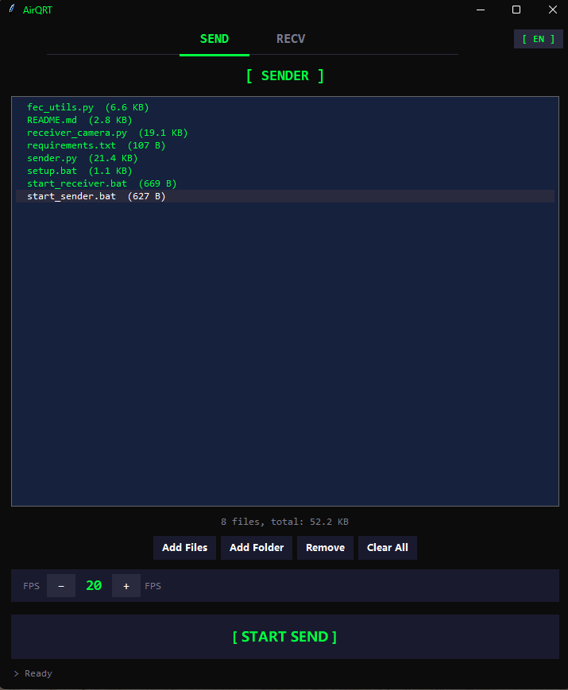
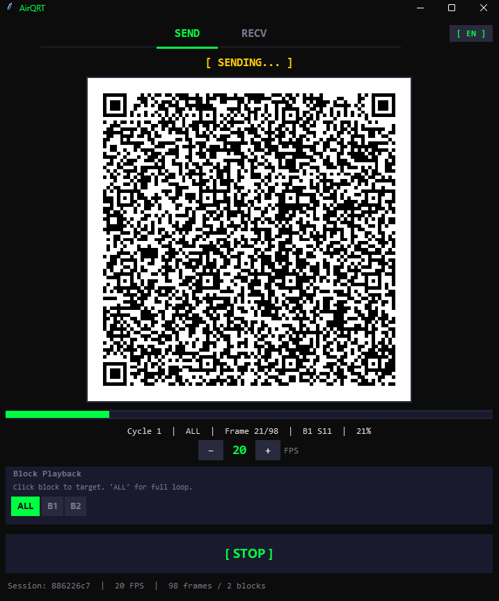

<p align="center">
  
</p>

<h1 align="center">AirQRT</h1>

<p align="center">
  Offline file transfer between Windows PCs via QR codes.
</p>

<p align="center">
  <b>English</b> · <a href="README.zh-CN.md">中文</a> · <a href="README.ja.md">日本語</a> · <a href="README.ru.md">Русский</a>
</p>

---

## How It Works

One machine **sends** files by displaying a rapid stream of QR codes on screen.  
Another machine **receives** by pointing its webcam at the screen and scanning the codes.

The data is compressed, split into frames, and protected by **Reed-Solomon FEC** (Forward Error Correction) — so even if the camera misses some frames, the file can still be fully recovered.

<p align="center">
  
  &nbsp;&nbsp;
  
</p>

## Download

Pre-built executable (no Python required):

> **[⬇ Download AirQRT (Windows .exe)](https://github.com/patrickconstfiv/AirQRT/releases/latest)**

**System requirements:** Windows 10/11, x86_64 (64-bit).

## Features

- **Completely offline** — no Wi-Fi, Bluetooth, or internet needed
- **One-click GUI** — dark terminal-style interface, drag & drop files
- **FEC error recovery** — tolerates missed frames via Reed-Solomon coding over GF(256)
- **Cross-block interleaving** — consecutive frame losses spread across blocks for better resilience
- **Adjustable FPS** — tune speed to match your camera's scan rate
- **Block-targeted replay** — click any block to re-send only what's missing
- **Multi-language UI** — English, 中文, Русский, 日本語

## Quick Start (from source)

### Prerequisites

- Python 3.9+
- A webcam on the receiving machine

### Install

```bash
git clone https://github.com/patrickconstfiv/AirQRT.git
cd AirQRT
pip install -r requirements.txt
```

### Run

```bash
python app.py
```

The GUI opens with two tabs: **SEND** and **RECV**.

#### Sending

1. Switch to the **SEND** tab
2. Click **Add Files** (or drag & drop)
3. Adjust FPS if needed
4. Click **[ START SEND ]**

#### Receiving

1. Switch to the **RECV** tab
2. Point your webcam at the sender's screen
3. Click **[ START RECV ]**
4. Files are saved to `received_files/` when complete

## Build Executable

```bash
pip install pyinstaller
pyinstaller --onefile --windowed --name "AirQRT" --icon=icon.ico --hidden-import=windnd app.py
```

The `.exe` will be in the `dist/` folder.

## FEC Error Recovery

The system uses block-level FEC based on Reed-Solomon codes:

| Parameter | Default |
|-----------|---------|
| Data shards per block | 50 |
| Redundancy ratio | 30 % |
| QR error correction | Level M (15 %) |

**Example:** A block of 50 data frames generates 15 parity frames (65 total).  
As long as *any* 50 of those 65 frames are scanned, the full block is recovered — regardless of which frames were missed.

## Performance Guide

| File Size | Approx. Time |
|-----------|--------------|
| 10 KB | ~5 s |
| 50 KB | ~15 s |
| 100 KB | ~30 s |
| 500 KB | ~2.5 min |

Best suited for small files (< 500 KB). For larger files, compress before sending.

## Tuning

Edit `sender.py` to adjust parameters:

```python
CHUNK_SIZE = 300            # bytes per data shard (smaller = easier to scan)
FRAME_FPS = 20              # default frames per second
FEC_DATA_SHARDS = 50        # data frames per FEC block
FEC_REDUNDANCY_RATIO = 0.30 # 30% parity overhead
QR_ERROR_LEVEL = 'M'        # L / M / Q / H
```

## Troubleshooting

| Problem | Fix |
|---------|-----|
| Camera won't open | Change `CAMERA_INDEX` in `receiver_camera.py` to `1` or `2` |
| Low scan rate | Decrease `CHUNK_SIZE`, lower FPS, or increase `FEC_REDUNDANCY_RATIO` |
| Large file too slow | Compress the file first (zip/7z), then send the archive |

## Project Structure

```
├── app.py               # GUI application (Tkinter)
├── sender.py            # File compression, QR encoding, FEC framing
├── receiver_camera.py   # Camera scanning, QR decoding, FEC recovery
├── fec_utils.py         # Reed-Solomon codec over GF(256)
├── icon.png             # App icon
├── build_exe.bat        # One-click EXE build script
├── requirements.txt     # Python dependencies
└── received_files/      # Output directory for received files
```

## License

MIT License. See [LICENSE](LICENSE) for details.

---

<p align="center"><i>Built for the moments when a USB drive isn't around.</i></p>
